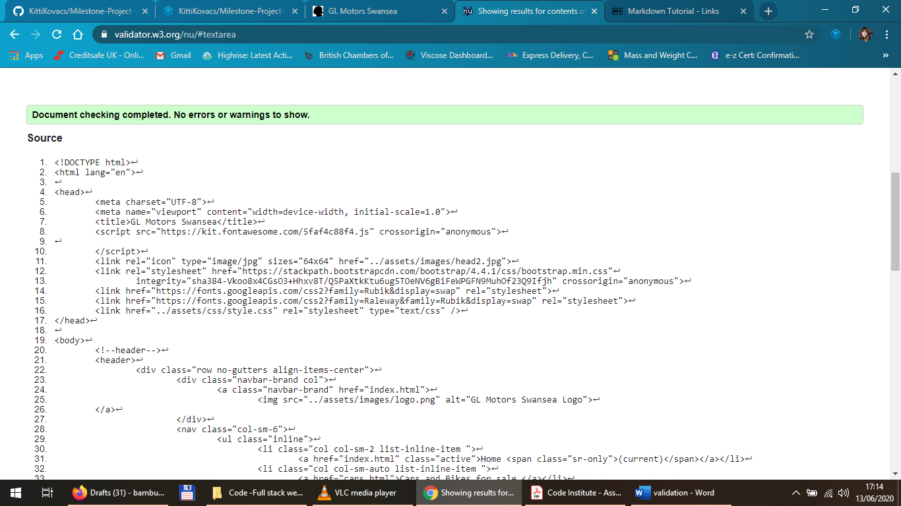
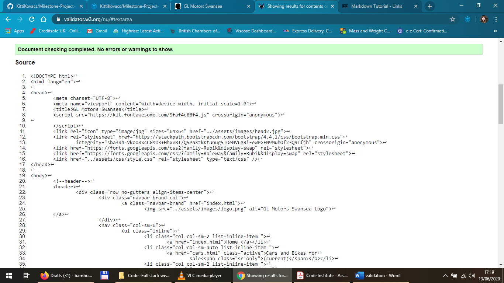
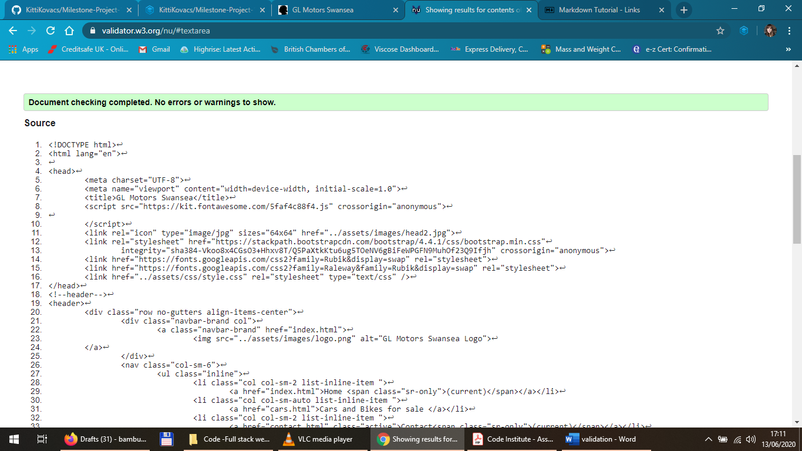
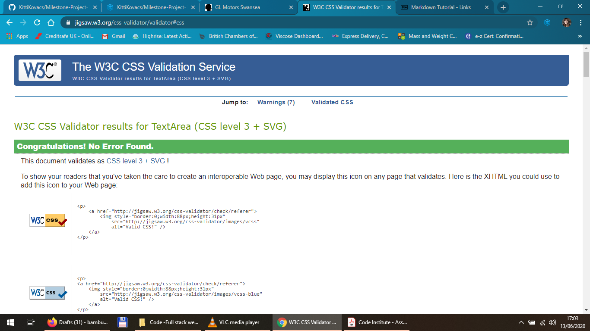
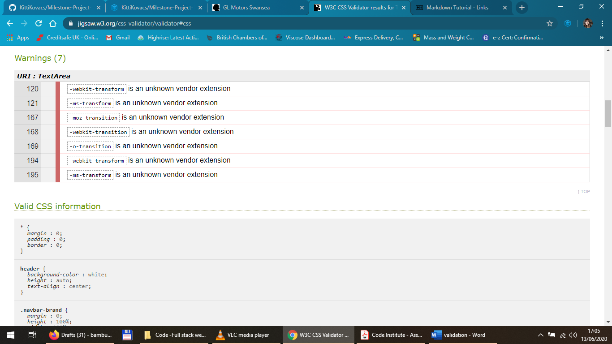

# Milestone-Project-1-User-Centric-Front-End-Development

The project is a website for a real-life small car and motorbike repairs and motor trader business.

## UX

 The purpose of this project is to make the garage and its services known to a wider
audience and generate more business.

The target audience is private individuals looking for a reliable local garage for repairs, advice or used cars and motorbikes.

[Wireframe](https://github.com/KittiKovacs/Milestone-Project-1-User-Centric-Front-End-Development/blob/master/GL%20Motors%20wireframes.pdf)

## User stories

* User 1 has a specific issue with their car and they check if this garage is potentially able to fix it by reading up about the services on the homepage.

* User 2 is looking for used cars or motorbike from a trustworthy local source, and comes across this website where he can find photos and basic information about the available models, and send a query through the website by filling in the contact form.

* User 3 is in an emergency and needs their car fixed by Monday to be able to go to work. He is looking for a mechanic who’s working flexible hours, even weekends. Looking at the contact page he can check the opening hours and quickly contact the business by calling the telephone number in the header.

Users see similar layout and colour scheme on all 3 pages. It features the same background image on all 3 pages with a white header on top and black footer on the bottom.  

The website is responsive, on medium and small viewports the telephone number is hidden from the header and on small wiewports the menu items are stacked below the company logo. The content also shrinks to  fit the current viewport width.

## Features

### Existing Features
* **Header**-contains company name and logo, navigation links and basic contact details. The navigation links get an underline animation on mouse hover. By clicking on the companty logo the user is able to return to the main page from any page.
 
* **Footer**- Contains links to **social media** pages. This is currently the company's Facebook page only. The Facebook logo changes colour on mouse hover to indicate to the user that there is an action available.

* **Home page** – contains a short introduction and a list of **services** provided by the garage. The list style icons are replaced by a wrench icon to match the company's profile. 
This page also contains a callout to users who are interested in buying car parts and a link to the owner's Ebay page. 

* **Cars&Bikes page**- Contains a short description of cars and motorbikes currently for sale and a**photo gallery** below each description. On hovering over the thumbnail images with the mouse they enlarge by 25%. Each image opens in a separate browser tab when a user clicks on them. 

* **Contact page**-informs the user about the **address** of the business and **opening times**; features a **Google maps** snippet which leads to the Google Maps website when clicked on. The page also features a **contact form** that is  going to enable users in the future to send a message to the business directly when they click on the Send button. The button changes colour and the cursor changes to a pointer on mouse hover.

### Features Left to Implement

* Webshop
* More complex contact form with subject options (Request a part, general
enquiry, I have something for sale, etc.) 
* Animated image gallery with professional photos of the cars for sale
* Language choice options
* News section
* Blog
* Client testimonials

## Technologies Used

* HTML to create the code for the website's content
* CSS to add styling to HTML
* Bootstrap for advaced styling and positioning
## Testing

All HTML code passed the W3C's [markup validation](https://validator.w3.org/).

The CSS code passed the W3C's [CSS validation](https://jigsaw.w3.org/css-validator/).

## Deployment

The 

## Credits

* Code Institute course material
* Bootstrapv 4.5.0 (https://getbootstrap.com/)
* Font Awesome
* Google Fonts
* Google Maps
* (https://www.w3schools.com/)
* my Tutor Guido Cecilio Garcia Bernal
* Image sources: https://www.pexels.com/, the garage's owner's own photos of vehicles for sale
